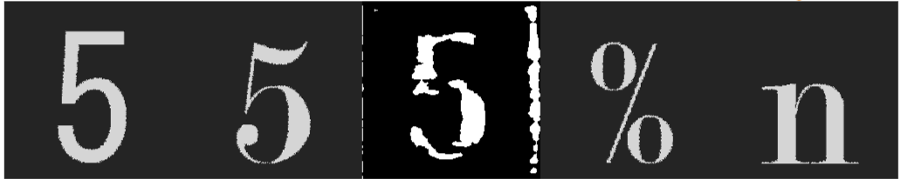

## FontCreator
同じフォントの文字の画像をいくつか入力することで，そのフォントの別の文字を推測するモデルです，

文字，フォントのエンコードをする部分では[EfficientNet](https://arxiv.org/abs/1905.11946)という画像認識モデルを，生成する部分では[StyleGAN](https://arxiv.org/abs/1812.04948)という画像生成モデルを用いており，この全体の構成は[pixel2style2pixel](https://arxiv.org/abs/2008.00951)を基にしています．

    
    最も左がゴシック体，その隣がGroundTruth．中央が出力で，右二つがGTと同じフォントの別の画像．

## 使用ライブラリ
Pytorch
OpenCV2
TensorboardX
ipywidgets
Pillow

## 訓練方法
1. このReadMeがあるディレクトリに"Fonts"ディレクトリを作成し，訓練，テストに使用するフォントファイルを入れてください．
1. 以下のディクショナリデータを作成し，pickleで以下のファイルに出力してください．
    - checker.pkl ... フォントのパスをキー，フォントがどれに対応しているかのbool値のリストを値とする．
        - 値のリストは[英数字, 記号, かな, JIS第一水準漢字, JIS第二水準漢字]に対応．対応していればTrue，していなければFalseを入れる．
    - fixedDataset.pkl ... テストデータで常に同じ字を出力するためにあらかじめ指定しておくデータ．インデックスをキー，出力させたい字のリストを値として持つ．リストの長さは固定長にすること．
    - styleChecker.pkl ... フォントのパスをキー，スタイルの情報(太さなど)をfloatのリストとして値に持つディクショナリ．
        - float値は0.0 ~ 1.0を入力し，固定長であること．
1. cptsディレクトリを作成し，train_net.ipynbで訓練を実行してください．
    1. まずChara, StyleEncoderを訓練する必要があります．それぞれを訓練する場合は，先頭のforCharaTrain, forStyleTrainをいずれか片方をTrueに設定してください．CharaEncoderを訓練する場合は，modelLevelをまず1に設定し，訓練が進み次第1ずつ増やし，3まで訓練を続けてください．
    1. それが終わり次第両方をFalseに設定し，通常の訓練を行ってください．訓練が非常に不安定なのでご注意ください．

